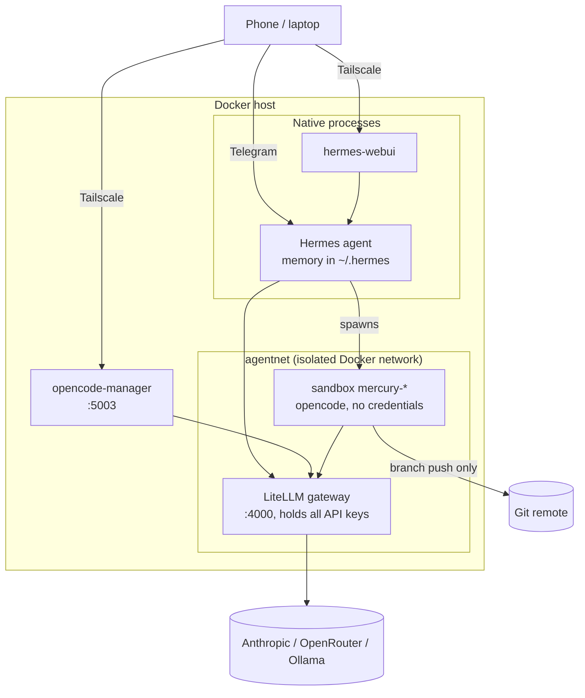
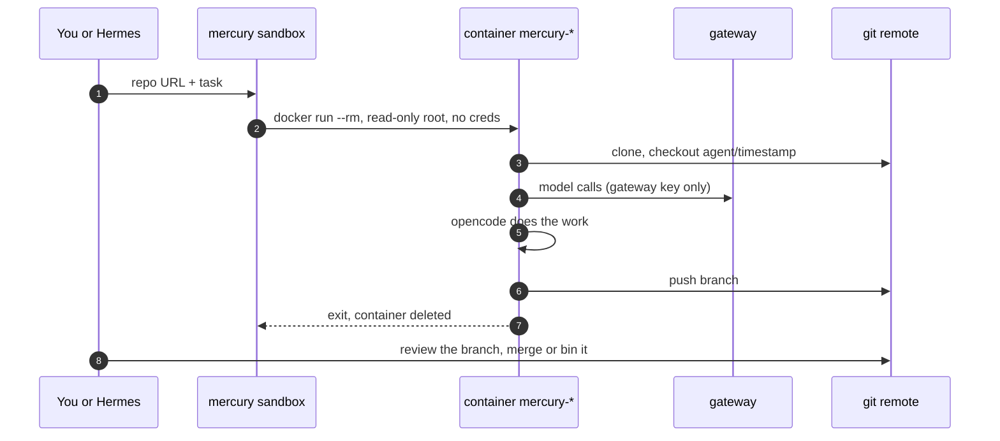

# MercurySandbox

A safe playground for autonomous coding agents. One always-on brain, disposable hands.

[](https://github.com/benkelly/MercurySandbox/actions/workflows/ci.yml)

MercurySandbox runs a persistent [Hermes agent](https://github.com/NousResearch/hermes-agent) that remembers everything, and hands the actual coding work to [opencode](https://opencode.ai) running inside throwaway Docker containers. Model API keys live in one gateway, sandboxes hold no credentials, and the only way work leaves a sandbox is a git branch you review.

## Architecture



The split that matters: Hermes is the only long-lived piece and `~/.hermes/` (plain markdown) is its entire brain, back that up and the whole setup is portable. Sandboxes are cattle, spawned per task, destroyed on exit.

## Sandbox lifecycle



Every sandbox runs with `--rm`, a read-only root filesystem, tmpfs workdirs, dropped capabilities, memory and CPU caps, and network access to the gateway only. The git token is a fine-grained PAT scoped to the repos agents may touch, branch pushes only.

## Quick start

```bash
git clone https://github.com/benkelly/MercurySandbox.git && cd MercurySandbox
cp .env.example .env      # fill in your keys
./bin/mercury up          # terraform: network, gateway, sandbox image
./bin/mercury doctor      # everything healthy?
./bin/mercury sandbox https://github.com/you/some-repo.git "add a health endpoint"
```

Then, each optional and independent:

```bash
./bin/mercury install hermes    # persistent agent, native (pick its Docker backend)
./bin/mercury install webui     # browser/mobile UI for Hermes
./bin/mercury install ocm       # opencode-manager PWA on :5003
```

## The mercury CLI

| Command | Does |
|---|---|
| `mercury up` / `plan` / `down` | Terraform apply / plan / destroy (down refuses while sandboxes run) |
| `mercury sandbox <url> [task] [model]` | Spawn a throwaway opencode sandbox, interactive TUI if no task given |
| `mercury ps` / `logs` / `exec` / `kill` | Inspect and manage running sandboxes |
| `mercury models` | List models the gateway exposes |
| `mercury status` | Gateway container status |
| `mercury doctor` | Health-check the whole stack |
| `mercury install <hermes\|webui\|ocm>` | Run an install script |
| `mercury -H you@host <cmd>` | Run any of the above on a remote host over SSH |

## Remote access

Tailscale first: install it on the Docker host and your devices, reach every UI privately over the tailnet, expose nothing. A sample ACL policy locking personal devices to just the needed ports is in [`docs/tailscale-acl.example.json`](docs/tailscale-acl.example.json).

A Cloudflare Tunnel is optionally supported (`CLOUDFLARE_TUNNEL_TOKEN` in `.env`) for sharing a UI beyond your tailnet, but understand the trade: a tunnel puts hostnames on the public internet, so put a Cloudflare Access policy in front of every route, and never route to the gateway. The Terraform keeps cloudflared off the gateway's network entirely so that mistake can't be made by accident.

## Model routing

`litellm/config.yaml` is the only file that knows about providers. Clients (Hermes, opencode, opencode-manager) all speak to one OpenAI-compatible endpoint and pick a model by name, so adding a provider, swapping the cheap default, or pointing a name at local Ollama is a one-file change and a `mercury up`.

## Repo layout

```
bin/mercury            CLI front door
terraform/             gateway, networks, sandbox image, optional tunnel
litellm/config.yaml    model routing, the only place providers are named
sandbox/               throwaway image + spawn script
scripts/               native installers (hermes, webui, ocm) + tf env helper
docs/                  ACL example and friends
```

## Security model

- All provider keys live in the LiteLLM gateway, nothing else ever sees them
- Sandboxes: no credentials, read-only root, tmpfs, capped, `--rm`, isolated network
- Git branch push is the only write path out, you merge, agents never touch main
- Gateway binds to localhost, remote access rides Tailscale
- Terraform state contains keys, it's gitignored, keep it that way

## License

MIT
