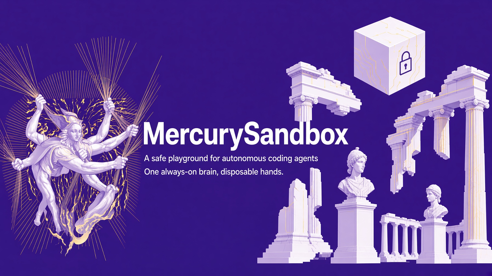
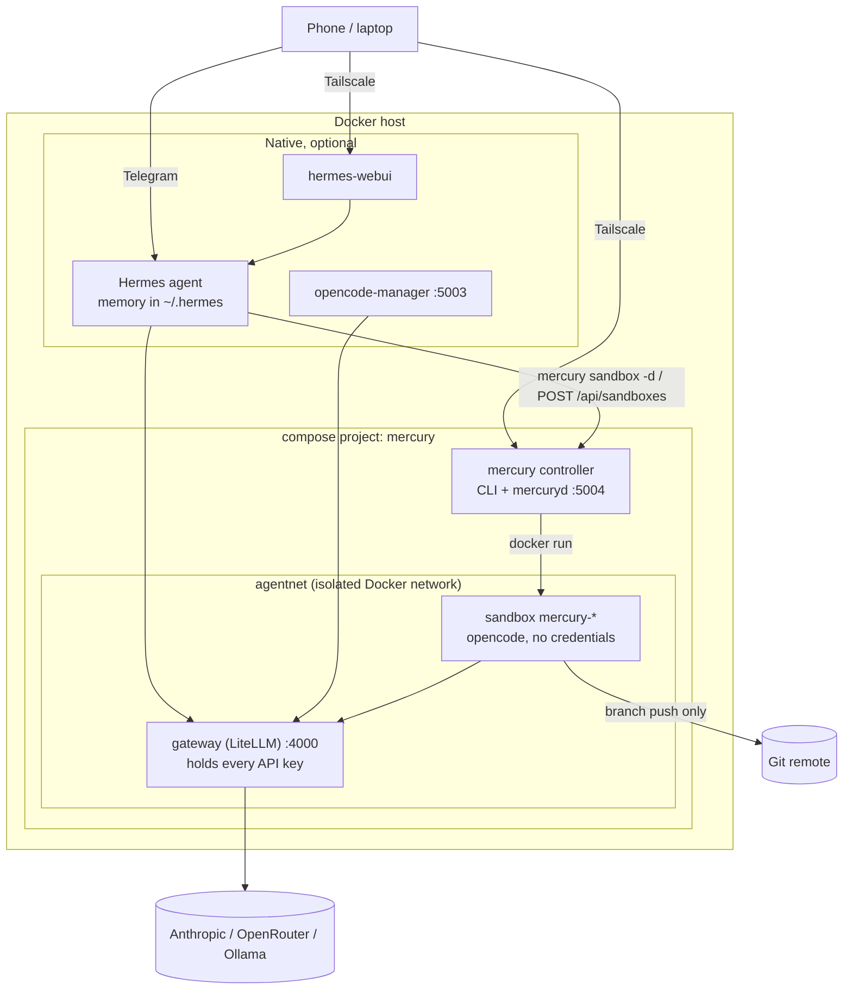
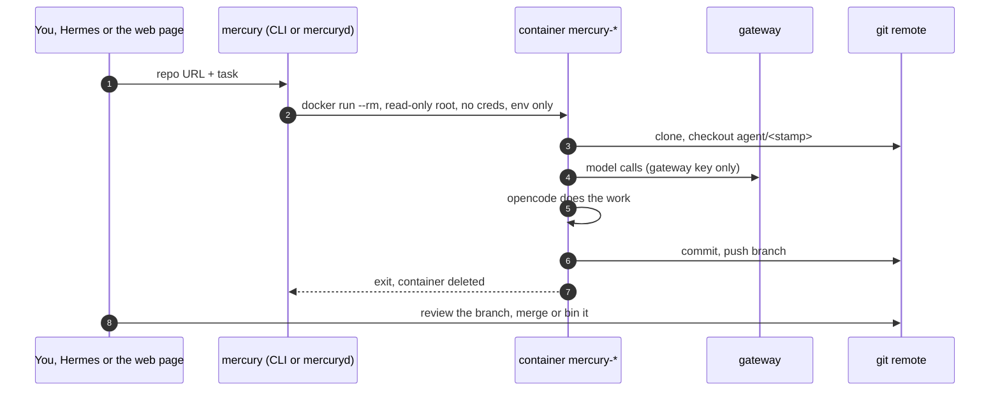

# MercurySandbox

A safe playground for autonomous coding agents. One always-on brain, disposable hands.

[](https://github.com/benkelly/MercurySandbox/actions/workflows/ci.yml)



MercurySandbox runs a persistent [Hermes agent](https://github.com/NousResearch/hermes-agent) that remembers everything, and hands the actual coding work to [opencode](https://opencode.ai) running inside throwaway Docker containers. Model API keys live in one gateway, sandboxes hold no credentials, and the only way work leaves a sandbox is a git branch you review.

The whole stack is a `compose.yaml` plus one small controller, so the same thing runs on a laptop, on a server over Tailscale, as a [Home Assistant add-on](https://github.com/benkelly/ha-addons/tree/main/mercury-sandbox), or on Kubernetes with the [Helm chart](charts/mercury), where sandboxes become Jobs.

**Docs: [benkelly.github.io/MercurySandbox](https://benkelly.github.io/MercurySandbox/)**, with getting-started guides for each of those, the concepts, and a full reference. The source is in [`site/`](site/).

## Architecture



Three long-lived pieces, each with one job:

- **gateway**: LiteLLM, the only container that ever sees a provider key. Everything else speaks OpenAI-compatible HTTP to it with one master key and picks a model by name from [`gateway/config.yaml`](gateway/config.yaml).
- **mercury controller**: the `mercury` CLI packaged with the Docker CLI and `mercuryd`, a small HTTP API and web page. It spawns sandboxes on the host's Docker through the socket. Same code as `bin/mercury`, same image as the Home Assistant add-on.
- **Hermes** (optional, native): the agent with memory. `~/.hermes/` (plain markdown) is its entire brain; back that up and the whole setup is portable.

Sandboxes are cattle: one repo and one task each, spawned by `docker run` (or as a Job), destroyed on exit. The full design, trust boundaries and the four deployment shapes are in the [architecture docs](https://benkelly.github.io/MercurySandbox/docs/concepts/architecture/).

## Sandbox lifecycle



Every sandbox runs with `--rm`, a read-only root filesystem, tmpfs workdirs, dropped capabilities, no-new-privileges, a pids limit, memory and CPU caps, a time limit, and network access to the gateway's network only. What a sandbox gets is defined once, in [`lib/sandbox.sh`](lib/sandbox.sh); how it runs is a backend ([Docker](lib/backend-docker.sh) or [Kubernetes](lib/backend-kube.sh)); the container side is [`sandbox/entrypoint.sh`](sandbox/entrypoint.sh).

### Least privilege

With nothing configured, a sandbox holds the gateway master key and your git token. Two optional features narrow that to what one task needs:

- **Virtual keys** (`MERCURY_VIRTUAL_KEYS=1`): the controller mints a LiteLLM key per sandbox, limited to the one model, a dollar budget and an expiry. The master key never enters a sandbox.
- **GitHub App tokens** (`GITHUB_APP_*`): the controller mints a one-hour installation token per sandbox for its one repository. `SANDBOX_GIT_TOKEN` becomes a fallback for repositories off GitHub.

The token still reaches git through a credential helper, never a URL or a file. Setup and the blast-radius comparison are in [Locking down credentials](https://benkelly.github.io/MercurySandbox/docs/concepts/credentials/).

### Context

Each sandbox reads a global `AGENTS.md` explaining the harness (branch exists, commit and push are handled, time and budget limits, read the repo's own instructions, finish with a reviewer summary), replaceable with `SANDBOX_RULES_FILE`. Per task, `--context` (or the context box on the page) appends links, constraints and how to test. `--open-pr` opens the pull request for you when the run pushes.

## Quick start

```bash
git clone https://github.com/benkelly/MercurySandbox.git && cd MercurySandbox
cp .env.example .env      # fill in your keys
./bin/mercury up          # compose: gateway + controller, builds the sandbox image
./bin/mercury doctor      # everything healthy?
./bin/mercury sandbox https://github.com/you/some-repo.git "add a health endpoint"
```

Open http://127.0.0.1:5004 for the web page: spawn sandboxes, watch their logs, stop them.

Then, each optional and independent:

```bash
./bin/mercury install hermes    # persistent agent, native (pick its Docker backend)
./bin/mercury install webui     # browser/mobile UI for Hermes
./bin/mercury install ocm       # opencode-manager PWA on :5003
```

Requirements: Docker with the compose plugin, bash, curl. `jq` is nice to have.

## The mercury CLI

| Command | Does |
|---|---|
| `mercury up [--pull]` | `docker compose up` the gateway and controller, build or pull the sandbox image |
| `mercury down [--force]` / `stop` | Tear the stack down (refuses while sandboxes run) / stop it in place |
| `mercury status` / `doctor` / `models` | Stack containers and sandboxes / health checks / models the gateway exposes |
| `mercury logs <gateway\|mercury\|name>` | Follow a service or a sandbox |
| `mercury sandbox <url> [task] [model]` | Spawn a throwaway opencode sandbox, interactive TUI if no task |
| `mercury sandbox -d ...` | Same, in the background; `--context`, `--timeout`, `--budget`, `--open-pr`, `--branch`, `--base`, `--no-push`, `--shell` in `--help` |
| `mercury ps` / `exec` / `kill` | Inspect and manage running sandboxes |
| `mercury serve` | Run mercuryd on the host instead of in the container |
| `mercury install <hermes\|webui\|ocm>` | Run a native install script |
| `mercury -H you@host <cmd>` | Run any of the above on a remote host over SSH |

## mercuryd: the API and web page

`mercuryd` is a standard-library Python server that wraps the CLI. It is what the web page, Hermes and the Home Assistant ingress panel talk to.

| Method and path | Does |
|---|---|
| `GET /api/status` | Docker, gateway, models and sandboxes in one call |
| `GET /api/models` | Model names from the gateway |
| `GET /api/sandboxes` | Running sandboxes with repo, branch, model and task |
| `POST /api/sandboxes` | `{"repo", "task", "model"?, "branch"?, "base"?, "context"?, "open_pr"?}`, returns the sandbox name |
| `GET /api/sandboxes/<name>/logs?tail=N` | Plain-text logs |
| `DELETE /api/sandboxes/<name>` | Stop a sandbox |

It binds to loopback by default. If it ever leaves loopback, set `MERCURY_API_TOKEN` and send `Authorization: Bearer`: whoever reaches this port controls Docker on the host. Behind Home Assistant ingress the proxy has already authenticated the person, so the add-on trusts it and refuses everything else.

## Home Assistant

The [mercury-sandbox add-on](https://github.com/benkelly/ha-addons/tree/main/mercury-sandbox) is this controller image with a `run.sh` that turns add-on options into `.env`, brings the gateway up as a sibling container on the host's Docker, and serves the web page through ingress. How that works, and what `docker_api` costs, is in the [Home Assistant guide](https://benkelly.github.io/MercurySandbox/docs/getting-started/home-assistant/).

## Kubernetes

`helm install mercury charts/mercury` gives you the gateway and the controller as Deployments and every sandbox as a hardened Job with its own Secret, a deadline and a NetworkPolicy. See the [Kubernetes guide](https://benkelly.github.io/MercurySandbox/docs/getting-started/kubernetes/).

## Remote access

Tailscale first: install it on the Docker host and your devices, reach every UI privately over the tailnet, expose nothing. A sample ACL policy locking personal devices to just the needed ports is in [`docs/tailscale-acl.example.json`](docs/tailscale-acl.example.json).

A Cloudflare Tunnel is optionally supported (`CLOUDFLARE_TUNNEL_TOKEN` in `.env` turns on the `tunnel` compose profile) for sharing a UI beyond your tailnet, but understand the trade: a tunnel puts hostnames on the public internet, so put a Cloudflare Access policy in front of every route, and never route to the gateway or to mercuryd. The compose file keeps cloudflared off `agentnet` entirely so that mistake can't be made by accident.

## Model routing

`gateway/config.yaml` is the only file that knows about providers. Clients (Hermes, opencode, opencode-manager, mercuryd) all speak to one OpenAI-compatible endpoint and pick a model by name, so adding a provider, swapping the cheap default, or pointing a name at local Ollama is a one-file change and a `mercury up`. The config is baked into a tiny image on top of a pinned LiteLLM release, so no host path is ever bind-mounted and the compose file applies unchanged from anywhere, the add-on included.

## Images and releases

| Image | Built from | Published |
|---|---|---|
| `ghcr.io/benkelly/mercury` | `Dockerfile` (Alpine, docker-cli, compose, mercuryd) | `edge` on main, `X.Y.Z` and `latest` on tag `vX.Y.Z` |
| `ghcr.io/benkelly/mercury-sandbox` | `sandbox/Dockerfile` (node, opencode) | same |
| `mercury-gateway:local` | `gateway/Dockerfile` (pinned LiteLLM + your config) | built locally by `mercury up`, never published |
| `charts/mercury` | Helm chart, version follows `VERSION` | install from the checkout |

Releases are cut by [release-please](https://github.com/googleapis/release-please) from Conventional Commits on `main`: merge its release PR and the tag, the GitHub release and the images follow. A hand-pushed `vX.Y.Z` tag works too. See [Releasing](https://benkelly.github.io/MercurySandbox/docs/operations/releasing/).

## Repo layout

```
bin/mercury            CLI front door
lib/                   common.sh, stack.sh (compose), sandbox.sh (the spec), creds.sh, backend-*.sh
compose.yaml           gateway, controller, optional tunnel; compose.keys.yaml adds the key database
charts/mercury         Helm chart: the same stack with sandboxes as Jobs
gateway/               pinned LiteLLM image + config.yaml, the only place providers are named
sandbox/               throwaway image, entrypoint (clone, run, commit, push, PR) and AGENTS.md rules
mercuryd/              HTTP API + web page over the CLI, and its tests
Dockerfile             the controller image (also the add-on base)
scripts/               native installers (hermes, webui, ocm)
site/                  the docs site (Hugo), deployed to GitHub Pages
docs/                  banner and the Tailscale ACL example
```

## Security model

- All provider keys live in the gateway, nothing else ever sees them
- Sandboxes: read-only root, tmpfs, capped, timed, `--rm`, isolated network, and at most a per-sandbox model key and a one-hour single-repo git token
- Git branch push is the only write path out, you merge, agents never touch main
- Gateway and mercuryd bind to loopback, remote access rides Tailscale
- The controller holds the Docker socket, which is root on the host: treat its port like SSH
- `.env` holds every secret and is gitignored, keep it that way

## License

MIT
