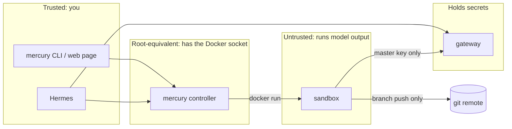

# Architecture

MercurySandbox is three long-lived pieces and any number of short-lived ones.

| Piece | Runs as | Holds | Talks to |
|---|---|---|---|
| gateway | compose service, LiteLLM | every provider API key | model providers |
| mercury controller | compose service (or `bin/mercury` on the host) | the Docker socket, `.env` | Docker, the gateway |
| Hermes | native process, optional | its memory in `~/.hermes` | the gateway, the controller |
| sandbox `mercury-*` | `docker run --rm`, one per task | nothing | the gateway, one git remote |

## Trust boundaries

- A **sandbox** executes whatever the model decides. It is treated as hostile: read-only root, tmpfs for `/work`, `/home/agent` and `/tmp`, `--cap-drop ALL`, `no-new-privileges`, a pids limit, memory and CPU caps, and only the `agentnet` network. It carries the gateway master key (so it can call models) and a scoped git token (so it can push a branch). Neither is on disk: the token is served to git through a credential helper that reads it from the environment at call time.
- The **gateway** is the only process with provider keys. It is published on loopback only. Compromising a sandbox gets an attacker model calls billed to you, bounded by whatever LiteLLM budget you set, and nothing else.
- The **controller** owns the Docker socket, which is root on the host. Its HTTP port is loopback by default, and it refuses requests without a bearer token if you widen that. Behind Home Assistant ingress it accepts requests only from the ingress proxy.
- **Hermes** is you, with memory. It stays native so its memory sits on a filesystem you back up.

## Deployment shapes

The same `compose.yaml` and the same controller image serve all three; only who runs `mercury up` differs.

| | Laptop | Server | Home Assistant |
|---|---|---|---|
| Runs `mercury up` | you, `bin/mercury` | you over SSH, `mercury -H host up` | the add-on's `run.sh` at every start |
| Gateway | compose service | compose service | compose service, sibling of the add-on |
| Controller | compose service + CLI on host | compose service | the add-on container itself |
| Sandboxes | host Docker | host Docker | host Docker, siblings of the add-on |
| Reach the web page | http://127.0.0.1:5004 | Tailscale | ingress panel |

Nothing in the compose file bind-mounts a host path except the Docker socket. That is what lets the add-on apply it: from inside a container, a host path in a compose file would refer to a filesystem the add-on cannot see. The gateway therefore gets its config by building a one-layer image on top of a pinned LiteLLM release (`gateway/Dockerfile`), and the sandbox gets its instructions through environment variables (`sandbox/entrypoint.sh`).

## Where each concern lives

| Concern | File |
|---|---|
| How a sandbox is hardened | `lib/sandbox.sh`, nowhere else |
| What a sandbox does once running | `sandbox/entrypoint.sh` |
| Which providers and models exist | `gateway/config.yaml` |
| Which containers make up the stack | `compose.yaml` |
| Safety checks around up/down | `lib/stack.sh` |
| The HTTP surface | `mercuryd/server.py` (`mercuryd/ui.html` is the page) |
| Add-on glue | `mercury-sandbox/run.sh` in the ha-addons repository |

## Spawning a sandbox

`mercury sandbox` (and `POST /api/sandboxes`, which calls it) builds a `docker run` from the flags in `lib/sandbox.sh` and this environment contract:

| Variable | Meaning |
|---|---|
| `MERCURY_REPO_URL` | repo to clone |
| `MERCURY_TASK` | prompt for `opencode run`; empty means the interactive TUI |
| `MERCURY_MODEL` | a `model_name` from `gateway/config.yaml` |
| `MERCURY_BRANCH` | branch to create and push, `agent/<stamp>` by default |
| `MERCURY_BASE_BRANCH` | branch to clone instead of the remote default |
| `MERCURY_PUSH` | `0` commits without pushing |
| `MERCURY_GIT_TOKEN` | token for https remotes |
| `OPENAI_BASE_URL`, `OPENAI_API_KEY` | the gateway, in the form opencode expects |

Anything else that wants a sandbox (Hermes, a cron job, another add-on) can either call the CLI, call the API, or `docker run` the image with these variables set, which is deliberately boring.

Containers carry labels (`mercury.sandbox`, `mercury.repo`, `mercury.branch`, `mercury.model`, `mercury.task`) so `mercury ps`, `mercury doctor` and the web page can list them without any state of their own. There is no database anywhere in the stack.

## Versioning

`VERSION` is the single version number. A tag `vX.Y.Z` that matches it publishes `ghcr.io/benkelly/mercury:X.Y.Z` and `ghcr.io/benkelly/mercury-sandbox:X.Y.Z`; the Home Assistant add-on pins both. Pushes to `main` publish `edge` for people tracking the tip.

Upstream pins live in exactly one place each: LiteLLM in `gateway/Dockerfile`, cloudflared in `compose.yaml`, Alpine in `Dockerfile`, node in `sandbox/Dockerfile`. opencode itself is deliberately unpinned (`OPENCODE_VERSION` build arg if you need to), because tracking the latest agent tooling is the point of a throwaway image.
