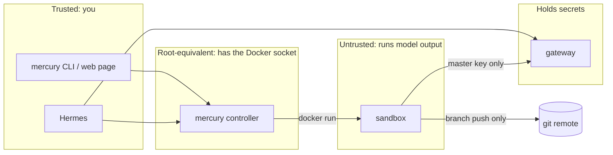

# Architecture

MercurySandbox is three long-lived pieces and any number of short-lived ones.

| Piece | Runs as | Holds | Talks to |
|---|---|---|---|
| gateway | compose service, LiteLLM | every provider API key | model providers |
| mercury controller | compose service (or `bin/mercury` on the host) | the Docker socket, `.env` | Docker, the gateway |
| Hermes | native process, optional | its memory in `~/.hermes` | the gateway, the controller |
| sandbox `mercury-*` | `docker run --rm`, one per task | nothing | the gateway, one git remote |

## Trust boundaries

- A **sandbox** executes whatever the model decides. It is treated as hostile: read-only root, tmpfs for `/work`, `/home/agent` and `/tmp`, `--cap-drop ALL`, `no-new-privileges`, a pids limit, memory and CPU caps, and only the `agentnet` network. It carries the gateway master key (so it can call models) and a scoped git token (so it can push a branch). Neither is on disk: the token is served to git through a credential helper that reads it from the environment at call time.
- The **gateway** is the only process with provider keys. It is published on loopback only. Compromising a sandbox gets an attacker model calls billed to you, bounded by whatever LiteLLM budget you set, and nothing else.
- The **controller** owns the Docker socket, which is root on the host. Its HTTP port is loopback by default, and it refuses requests without a bearer token if you widen that. Behind Home Assistant ingress it accepts requests only from the ingress proxy.
- **Hermes** is you, with memory. It stays native so its memory sits on a filesystem you back up.

## Deployment shapes

The same controller image serves all four; only who brings the stack up and which backend runs sandboxes differ.

| | Laptop | Server | Home Assistant | Kubernetes |
|---|---|---|---|---|
| Brings the stack up | you, `mercury up` | you over SSH, `mercury -H host up` | the add-on's `run.sh` at every start | `helm install` |
| Gateway | compose service | compose service | compose service, sibling of the add-on | Deployment |
| Controller | compose service + CLI on host | compose service | the add-on container itself | Deployment |
| Sandbox backend | docker | docker | docker, siblings of the add-on | kubernetes: a Job each |
| Reach the web page | http://127.0.0.1:5004 | Tailscale | ingress panel | port-forward or Ingress |

### Backends

`lib/sandbox.sh` decides *what* a sandbox gets (name, image, branch, caps, credentials, rules, context) and hands a spec to a backend that decides *how* it runs:

- `lib/backend-docker.sh`: `docker run --rm` with a read-only root, tmpfs mounts, dropped capabilities, `no-new-privileges`, a pids limit, memory and CPU caps, on the `agentnet` network.
- `lib/backend-kube.sh`: a Job with a `runAsNonRoot` uid 1000 pod, read-only root, all capabilities dropped, memory-backed `emptyDir`s with size limits, resource limits, a deadline, a per-sandbox Secret owned by the Job, and a NetworkPolicy from the chart.

Both expose the same five operations (`spawn`, `list_json`, `logs`, `kill`, `exec`), so `mercury ps --json`, the web page and the API behave identically on either. `SANDBOX_BACKEND` picks one; the chart sets it.

Nothing in the compose file bind-mounts a host path except the Docker socket. That is what lets the add-on apply it: from inside a container, a host path in a compose file would refer to a filesystem the add-on cannot see. The gateway therefore gets its config by building a one-layer image on top of a pinned LiteLLM release (`gateway/Dockerfile`), and the sandbox gets its instructions through environment variables (`sandbox/entrypoint.sh`).

## Where each concern lives

| Concern | File |
|---|---|
| How a sandbox is hardened | `lib/sandbox.sh`, nowhere else |
| What a sandbox does once running | `sandbox/entrypoint.sh` |
| Which providers and models exist | `gateway/config.yaml` |
| Which containers make up the stack | `compose.yaml` |
| Safety checks around up/down | `lib/stack.sh` |
| The HTTP surface | `mercuryd/server.py` (`mercuryd/ui.html` is the page) |
| Which credentials a sandbox gets | `lib/creds.sh` |
| How a spec becomes a container or a Job | `lib/backend-docker.sh`, `lib/backend-kube.sh` |
| What the agent is told | `sandbox/AGENTS.md`, `MERCURY_CONTEXT` |
| Kubernetes install | `charts/mercury` |
| Add-on glue | `mercury-sandbox/run.sh` in the ha-addons repository |

## Least privilege: what a sandbox is handed

A sandbox runs model output, so it should hold as little as possible, for as short a time as possible. Each credential has a narrow form and a fallback, chosen per sandbox by `lib/creds.sh` in the controller (which holds the long-lived secrets and never hands them on when it can avoid it):

| Credential | Narrow form (preferred) | Fallback |
|---|---|---|
| Gateway access | a LiteLLM **virtual key** minted for this sandbox: one model, a dollar budget (`SANDBOX_BUDGET_USD`), an expiry (`SANDBOX_KEY_TTL`), revoked early when a foreground run ends. Needs `MERCURY_VIRTUAL_KEYS=1` and a gateway database. | the master key |
| Git access | a **GitHub App installation token** for this one repository, contents write, one hour, plus `pull_requests: write` only with `--open-pr`. Needs `GITHUB_APP_ID`, `GITHUB_APP_INSTALLATION_ID` and the App's private key. | `SANDBOX_GIT_TOKEN` |
| Everything else | nothing. No provider keys, no Docker socket, no cluster token (`automountServiceAccountToken: false`), no host paths. | |

The blast radius of a compromised sandbox is then: up to the budget on one model until the key expires, and branch pushes to one repository for an hour. Compare that with a PAT and the master key, which is what you get without configuring either.

Setting up the GitHub App: create one under your account or organisation with repository permission `Contents: read and write` (and `Pull requests: read and write` if you want `--open-pr`), install it on exactly the repositories agents may touch, and note the App ID, the installation ID (from the installation's URL) and the private key it generates. That is the whole configuration.

## Context: what a sandbox is told

An agent with no idea where it is wastes its budget discovering the rules. Every sandbox therefore gets three layers of context, cheapest first:

1. **Rules**, as opencode's global `AGENTS.md`: baked into the image (`sandbox/AGENTS.md`), replaceable per deployment with `SANDBOX_RULES_FILE` (`sandbox.rules` in the chart, `AGENTS.md` in the add-on config folder). They explain the harness: the branch already exists, commit and push are handled, there is a time limit and a budget, do not touch tests to get green, end with a summary a reviewer can read.
2. **The repository's own instructions**: the rules tell the agent to read `AGENTS.md`, `CLAUDE.md`, `CONTRIBUTING.md` and `README.md` first and let them win.
3. **Per-task context**, `--context` (or `context` in the API and the page): links, constraints, where to look, how to test. Appended to the prompt under a heading, so the task itself stays short.

Runs are bounded by `MERCURY_TIMEOUT` (`timeout` inside the container, `activeDeadlineSeconds` on Kubernetes). Whatever the agent managed by then is still committed and pushed, marked as such in the log, so a cut-off run is reviewable rather than lost.

## Spawning a sandbox

`mercury sandbox` (and `POST /api/sandboxes`, which calls it) builds a `docker run` from the flags in `lib/sandbox.sh` and this environment contract:

| Variable | Meaning |
|---|---|
| `MERCURY_REPO_URL` | repo to clone |
| `MERCURY_TASK` | prompt for `opencode run`; empty means the interactive TUI |
| `MERCURY_MODEL` | a `model_name` from `gateway/config.yaml` |
| `MERCURY_BRANCH` | branch to create and push, `agent/<stamp>` by default |
| `MERCURY_BASE_BRANCH` | branch to clone instead of the remote default |
| `MERCURY_CONTEXT` | extra context appended to the prompt |
| `MERCURY_RULES` | global instructions; empty uses the image's `/etc/mercury/AGENTS.md` |
| `MERCURY_TIMEOUT` | seconds before opencode is stopped |
| `MERCURY_PUSH` | `0` commits without pushing |
| `MERCURY_OPEN_PR` | `1` opens a GitHub pull request after pushing |
| `MERCURY_GIT_TOKEN` | token for https remotes, ideally a one-hour App token |
| `OPENAI_BASE_URL`, `OPENAI_API_KEY` | the gateway, in the form opencode expects |

Anything else that wants a sandbox (Hermes, a cron job, another add-on) can either call the CLI, call the API, or `docker run` the image with these variables set, which is deliberately boring.

Containers carry labels (`mercury.sandbox`, `mercury.repo`, `mercury.branch`, `mercury.model`, `mercury.task`) so `mercury ps`, `mercury doctor` and the web page can list them without any state of their own. There is no database anywhere in the stack.

## Versioning

`VERSION` is the single version number. A tag `vX.Y.Z` that matches it publishes `ghcr.io/benkelly/mercury:X.Y.Z` and `ghcr.io/benkelly/mercury-sandbox:X.Y.Z`; the Home Assistant add-on pins both. Pushes to `main` publish `edge` for people tracking the tip.

Upstream pins live in exactly one place each: LiteLLM in `gateway/Dockerfile` (and `values.yaml` for the chart), cloudflared in `compose.yaml`, Alpine in `Dockerfile`, node in `sandbox/Dockerfile`. The chart's `version` and `appVersion` follow `VERSION`; CI checks that. opencode itself is deliberately unpinned (`OPENCODE_VERSION` build arg if you need to), because tracking the latest agent tooling is the point of a throwaway image.
