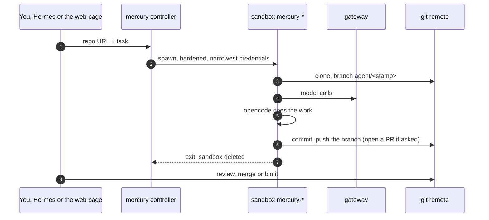

```mermaid
sequenceDiagram
    autonumber
    participant Y as You, Hermes or the web page
    participant M as mercury controller
    participant C as sandbox mercury-*
    participant G as gateway
    participant R as git remote

    Y->>M: repo URL + task
    M->>C: spawn, hardened, narrowest credentials
    C->>R: clone, branch agent/<stamp>
    C->>G: model calls
    C->>C: opencode does the work
    C->>R: commit, push the branch (open a PR if asked)
    C-->>M: exit, sandbox deleted
    Y->>R: review, merge or bin it
```
