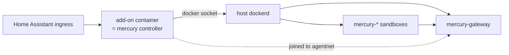

## Install

1. Add the repository `https://github.com/benkelly/ha-addons` under **Settings → Add-ons → Add-on store → Repositories**, or use the [one-click link](https://my.home-assistant.io/redirect/supervisor_add_addon_repository/?repository_url=https%3A%2F%2Fgithub.com%2Fbenkelly%2Fha-addons).
2. Install **MercurySandbox**. Read the security note in its docs first: the add-on controls Docker on the host.
3. In **Configuration**, set at least one provider key and a `git_token`. Leave `litellm_master_key` blank to have one generated.
4. Start it and watch the log. The first start pulls the LiteLLM and sandbox images, which takes a few minutes.
5. Open **MercurySandbox** in the sidebar: three green chips, then paste a repository and a task.

Every option is documented in the [add-on's DOCS.md](https://github.com/benkelly/ha-addons/blob/main/mercury-sandbox/DOCS.md). What follows is how it works underneath.

## How the add-on works

The [add-on](https://github.com/benkelly/ha-addons/tree/main/mercury-sandbox) is the controller image from this repository plus a `run.sh`. A Home Assistant add-on is a Docker container the Supervisor manages. It cannot run `docker compose` for itself in the usual sense, but with `docker_api: true` the Supervisor mounts the host's Docker socket into it, and from there the controller does exactly what it does on a server:

1. `run.sh` turns the add-on options into `/data/mercury.env` (the `.env`).
2. `mercury up` with `MERCURY_SERVICES=gateway` runs `docker compose up` on the host's Docker. The gateway becomes a sibling container of the add-on, on the `agentnet` network, exactly as on a laptop.
3. The sandbox image is pulled from GHCR rather than built, because building node images on a Raspberry Pi is nobody's idea of fun.
4. The add-on connects its own container to `agentnet` so mercuryd can reach the gateway by name.
5. `mercury serve` runs mercuryd on the ingress port. Ingress has already authenticated the person, so mercuryd trusts the ingress proxy and refuses everyone else unless an API token is set.
6. On stop, the gateway is stopped too. Running sandboxes are left alone and named in the log.

## What it costs

`docker_api` is a large grant: whoever controls the add-on controls every container on the host, Home Assistant included. That is inherent to what this add-on does and it is why the add-on's security rating is low. Two consequences:

- Install it only on a host where you are comfortable with that, and only from this repository.
- The gateway container it starts is not managed by the Supervisor. It does not appear in the add-on list, is not backed up with the add-on, and is not removed when the add-on is uninstalled. `DOCS.md` gives the cleanup commands.

## Custom model routing

Drop a copy of `gateway/config.yaml` at `/addon_configs/<slug>/litellm.yaml` (the add-on writes `litellm.example.yaml` next to it to start from) and restart. The add-on copies it into the gateway build context, so the same mechanism that works on a laptop works here.

## Least privilege on Home Assistant

`virtual_keys` starts a small Postgres beside the gateway (its password is generated once into add-on storage) so every sandbox gets its own budgeted, expiring gateway key. `github_app_id` and `github_app_installation_id` with the App's private key at `/addon_configs/<slug>/github-app.pem` give every sandbox a one-hour token for its one repository. An `AGENTS.md` in the same folder replaces the agent rules baked into the sandbox image; the add-on writes `AGENTS.example.md` next to it.

## Reaching the gateway from elsewhere

By default the gateway is published on the host's loopback only, which from Home Assistant's point of view is nearly useless: nothing else runs on that host. The `expose_gateway` option publishes it on all host interfaces instead, for a Hermes or opencode-manager on another machine. Do that only on a network you trust, or better, one you reach over Tailscale.
