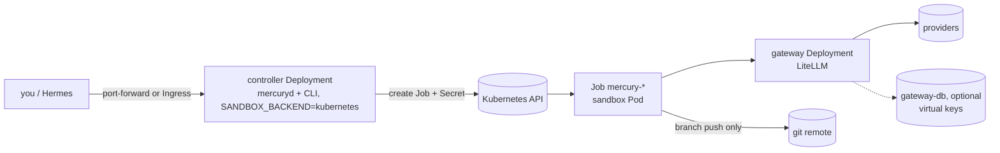

`charts/mercury` installs the gateway and the controller, and the controller
runs each sandbox as a Job in the same namespace with the same hardening the
Docker backend applies. No Docker socket, no privileged anything.



## Install

The chart is published to GHCR as an OCI artifact with every release, at the same version as the images it pulls:

```bash
helm install mercury oci://ghcr.io/benkelly/charts/mercury --version 0.1.0 \
  --namespace agents --create-namespace \
  --set secrets.litellmMasterKey="$(openssl rand -hex 24)" \
  --set secrets.anthropicApiKey=sk-ant-... \
  --set secrets.sandboxGitToken=github_pat_...
kubectl -n agents port-forward svc/mercury 5004:5004
```

`helm show values oci://ghcr.io/benkelly/charts/mercury --version 0.1.0` prints every setting. To install from a checkout instead, replace the OCI reference with `charts/mercury`.

Or keep secrets out of values entirely: create a Secret with the keys listed
in `values.yaml` under `secrets.existingSecret` and point the chart at it.

## What a sandbox Job looks like

| Setting | Value |
|---|---|
| Pod security | `runAsNonRoot`, uid/gid 1000, `RuntimeDefault` seccomp, no service account token |
| Container | read-only root, `allowPrivilegeEscalation: false`, all capabilities dropped |
| Filesystem | `/work`, `/home/agent`, `/tmp` are memory-backed `emptyDir`s with size limits |
| Resources | limits and requests from `sandbox.*` (Docker-style sizes accepted) |
| Lifetime | `backoffLimit: 0`, `activeDeadlineSeconds` = timeout + 600, `ttlSecondsAfterFinished` |
| Secrets | one Secret per sandbox, owned by the Job, garbage-collected with it |
| Network | no ingress; egress to the gateway, DNS, and public addresses on 443 and 22 only |

The NetworkPolicy assumes your CNI enforces policies (Calico, Cilium, most
managed offerings). If it does not, `sandbox.networkPolicy.enabled: false`
is honest about that rather than pretending.

## Virtual keys and GitHub Apps

Both least-privilege features work the same as elsewhere (see
[architecture](/docs/concepts/architecture/)). `gateway.virtualKeys.enabled` needs a
database: `bundledPostgres.enabled` renders a single-replica StatefulSet that
only the gateway can reach, or set `secrets.databaseUrl` for one you run.
`sandbox.githubApp.*` plus `secrets.githubAppPrivateKey` mints a one-hour
token per sandbox for its one repository.

## Day two

```bash
kubectl -n agents get jobs -l mercury.sandbox=1                 # what is running
kubectl -n agents exec deploy/mercury -- mercury ps             # same, through the CLI
kubectl -n agents exec deploy/mercury -- mercury doctor
kubectl -n agents exec deploy/mercury -- mercury logs mercury-20260913-011148-75b9
kubectl -n agents exec -it deploy/mercury -- mercury exec mercury-20260913-011148-75b9
```

Interactive sandboxes (the opencode TUI, `--shell`) are Docker-only; on
Kubernetes give every sandbox a task and use `mercury exec` on a running one
when you need to look inside.

The chart's `version` and `appVersion` track `VERSION`, and every release
pushes it to `oci://ghcr.io/benkelly/charts/mercury`. Upgrade with
`helm upgrade mercury oci://ghcr.io/benkelly/charts/mercury --version X.Y.Z --reuse-values`.
